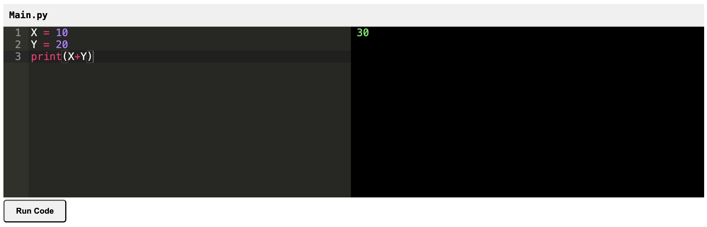

# code-editor-flask
Code editor written in HTML and CSS using FLask

## Overview
Here's an overview of the components we'll need:

- Frontend: HTML, CSS, and JavaScript with Ace editor

- Backend: Flask to handle code execution

  

## Setup
Git clone current repo to your local machine

​	`git clone https://github.com/pflagerd/code-editor-flask.git`

Move to code-editor-flask repository

​	`cd path/to/code-editor-flask`

Create a `.venv` virtual environment

​	`python -m venv .venv`

Activate the `.venv`

​	`source .venv/bin/activate`

Install required packages from `requirements.txt`

​	`pip install -r ./requirements.txt`

Run `code-editor-flask.py` (runs `code-editor-flask.py` in a flask web server)
```bash
python ./code-editor-flask.py
```
You should see something like:
```
 * Serving Flask app 'app'
 * Debug mode: on
WARNING: This is a development server. Do not use it in a production deployment. Use a production WSGI server instead.
 * Running on http://127.0.0.1:5000
Press CTRL+C to quit
 * Restarting with stat
 * Debugger is active!
 * Debugger PIN: 259-072-464
127.0.0.1 - - [25/Oct/2024 09:32:42] "GET / HTTP/1.1" 200 -
127.0.0.1 - - [25/Oct/2024 09:32:42] "GET /static/styles.css HTTP/1.1" 200 -
127.0.0.1 - - [25/Oct/2024 09:32:42] "GET /static/atom.ico HTTP/1.1" 200 -
127.0.0.1 - - [25/Oct/2024 09:33:03] "POST /run HTTP/1.1" 200 -
```

From a browser navigate to `http://127.0.0.1:5000` (or whatever Flask said when you ran it.)

You should see something like this:


